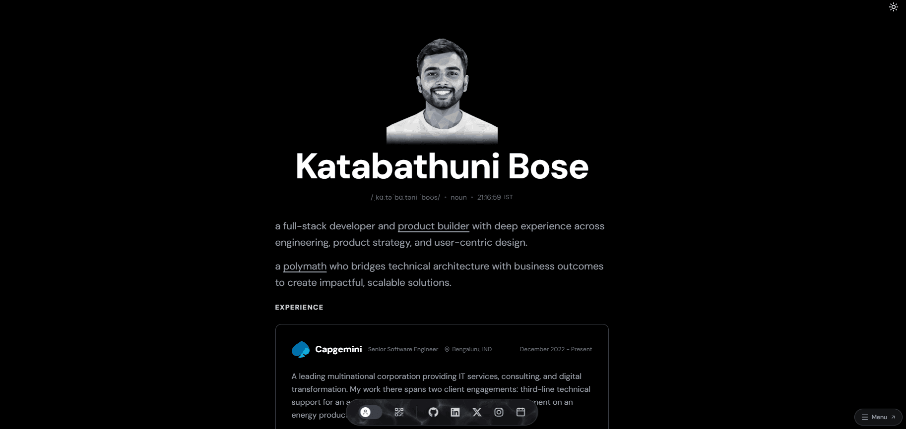

<div align="center">
  <a href="https://katbose.dev" aria-label="Visit katbose.dev">
    
  </a>

  <h1>Katabathuni Bose · Portfolio Platform</h1>

  <p>
    <strong>A modern digital home for engineering, product thinking, and writing.</strong><br>
    Content-driven, agent-readable, and built as a production-grade monorepo.
  </p>

  <p>
    <a href="https://katbose.dev"><strong>katbose.dev</strong></a>
    ·
    <a href="https://github.com/katbose">GitHub</a>
    ·
    <a href="https://www.linkedin.com/in/katbose/">LinkedIn</a>
    ·
    <a href="https://x.com/katbose_x">X</a>
    ·
    <a href="mailto:im@katbose.dev">Email</a>
    ·
    <a href="https://cal.com/katbose/meet">Book a call</a>
  </p>
</div>

---

## More than a portfolio page

I'm **Katabathuni Bose**, a full-stack developer and product builder based in
Bengaluru, India. `katbose.dev` is where I present my experience, experiments,
and writing—and where I explore how a personal site can be engineered like a
real product rather than maintained as a collection of hard-coded pages.

<table>
  <tr>
    <td width="50%" valign="top">
      <h3>Content as data</h3>
      <p>One structured JSON document controls the homepage, section order, essays, metadata, and social links. Content changes do not require component rewrites.</p>
    </td>
    <td width="50%" valign="top">
      <h3>Human + agent interfaces</h3>
      <p>Essays render as polished web pages for people and deterministic Markdown for agents, tools, and text-first readers—from the same source.</p>
    </td>
  </tr>
  <tr>
    <td width="50%" valign="top">
      <h3>Platform, not a single app</h3>
      <p>The portfolio, documentation, future CMS, dashboard, and shared configuration live in a Bun workspace with clear ownership boundaries.</p>
    </td>
    <td width="50%" valign="top">
      <h3>Production discipline</h3>
      <p>Exact dependency versions, layered quality gates, conventional commits, automated releases, and repository-wide standards keep the platform reproducible.</p>
    </td>
  </tr>
</table>

> [!TIP]
> For the implementation deep dive—content schema, routing, dual-view rendering,
> tests, and operational gotchas—read the **[web engineering guide](apps/web/README.md)**.

## Monorepo

<pre>
katbose-portfolio/
├── apps/
│   ├── <a href="apps/web">web/</a>                Portfolio, essays, metadata &amp; Markdown views
│   ├── <a href="apps/docs">docs/</a>               Architecture &amp; operating documentation
│   ├── <a href="apps/cms">cms/</a>                Reserved for content management
│   └── <a href="apps/dash">dash/</a>               Reserved for private tooling
└── packages/
    └── <a href="packages/typescript-config">typescript-config/</a>  Shared strict TypeScript configuration
</pre>

<sub>One repository · one release version.</sub>

## Technology

<div align="center">
  
  
  
  
  
  
  
  
  
</div>

## Local development

### Prerequisites

- **Bun `1.4.2`**—pinned by the root `packageManager` field
- **Node.js `>= 20.17`**—required by the Mintlify CLI

```powershell
# Clone and enter the repository
git clone https://github.com/katbose/katbose-portfolio.git
Set-Location katbose-portfolio

# Install every workspace and the repository hooks
bun install

# Start all workspaces that expose a dev script
bun run dev
```

Run one surface independently:

```powershell
bun --filter @katbose/web dev
bun --filter @katbose/docs dev
```

## Engineering workflow

| Command | Purpose |
|---|---|
| `bun run check` | Apply Biome formatting, lint, and import fixes |
| `bun run typecheck` | Type-check workspaces without emitting files |
| `bun run test` | Run unit tests |
| `bun run test:e2e` | Build and run the Playwright browser suite |
| `bun run build` | Produce workspace production builds |
| `bun run validate` | Validate documentation configuration and routes |

<details>
<summary><strong>Quality and release model</strong></summary>

- **Biome** owns repository-wide formatting and static analysis.
- **TypeScript 7** across every workspace; all dependencies use exact versions.
- **Bun Test** protects the content-to-Markdown pipeline and metadata helpers.
- **Playwright** exercises the production experience, themes, modes, essays, and animations.
- **Lefthook** runs pre-commit checks; **commitlint** enforces Conventional Commits.
- **release-please** versions the complete repository and creates tags exactly as `vX.Y.Z`.

</details>

## Content model

The public experience is composed from:

```text
apps/web/app/data/portfolio.json
```

Its ordered `sections` array is the homepage composition layer: moving an entry
moves the rendered section, and removing one removes it from the site. Essays
are stored in the same document and transformed into both HTML and Markdown.
This keeps authoring simple without coupling content edits to React code.

See [`apps/web/README.md`](apps/web/README.md) for every section type and
[`CLAUDE.md`](CLAUDE.md) for the agent-oriented schema reference.

## Project standards

This is a personal portfolio, but the repository is maintained with public,
reviewable standards:

<p align="center">
  <a href="https://github.com/katbose/katbose-portfolio/actions/workflows/ci.yml"></a>
  <a href="./LICENSE"></a>
  <a href="./.github/CODE_OF_CONDUCT.md"></a>
  <a href="./.github/SECURITY.md"></a>
  <a href="./.github/CONTRIBUTING.md"></a>
</p>

Security reports should be submitted privately through
[GitHub Security Advisories](https://github.com/katbose/katbose-portfolio/security/advisories/new).

## Sponsor this work

If the portfolio architecture, technical documentation, or writing helps you,
you can support the time spent building and maintaining it. Sponsorship helps
fund the domain, infrastructure, open documentation, and continued experiments
around content-driven and agent-readable web experiences.

<div align="center">
  <a href="https://github.com/sponsors/katbose">
    
  </a>
  <br><br>
  <strong>Thank you for supporting independent engineering and writing.</strong>
</div>

---

<div align="center">
  <sub>Initial design inspiration from <a href="https://github.com/PythonHacker24/yo-hackyfolio">Hackyfolio</a> by <a href="https://github.com/PythonHacker24">Aditya Patil</a>; re-engineered and substantially extended for <a href="https://katbose.dev">katbose.dev</a>.</sub>
  <br><br>
  <sub>© 2026 Katabathuni Bose · Released under the <a href="LICENSE">MIT Licence</a></sub>
</div>
